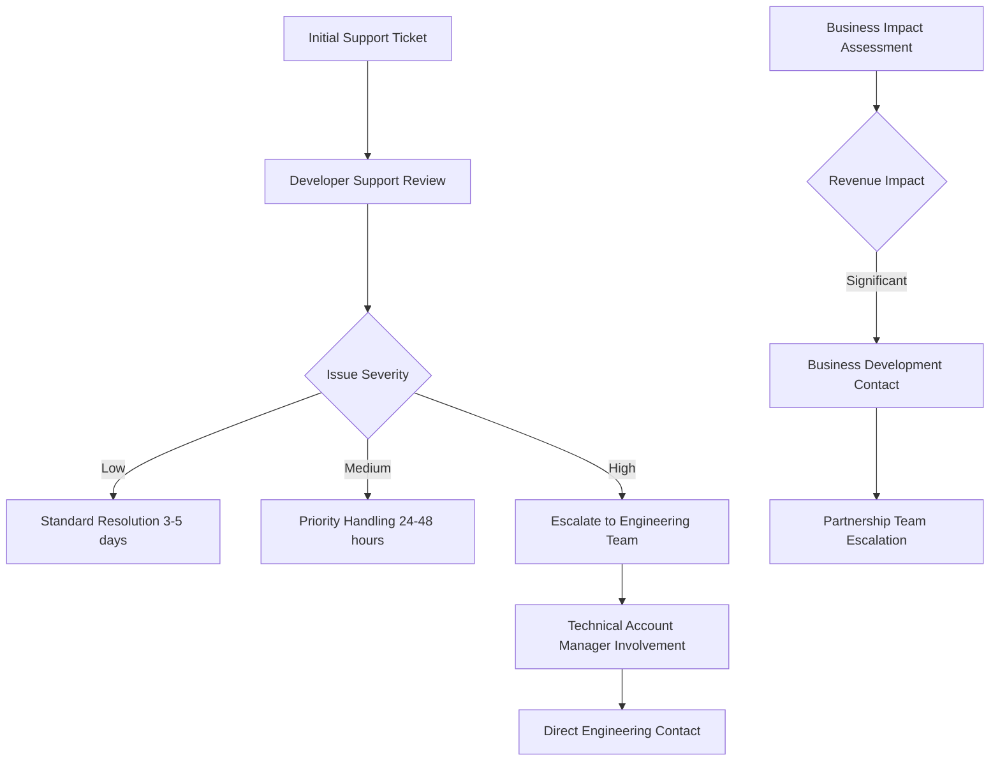

# Platform Contacts & Escalation Guide

**Comprehensive contact information, escalation procedures, and communication strategies for Uber Eats, DoorDash, and SkipTheDishes integration**

---

## 🎯 CONTACT GUIDE PURPOSE

This document provides **complete contact and escalation information** for platform integration support. It serves as:

- **Emergency contact directory** for critical platform issues
- **Escalation procedures** for technical and business challenges  
- **Communication templates** for professional platform outreach
- **Partnership development** guidance and best practices
- **Internal escalation paths** within Vizion Menu organization

**Target Audience**: Project managers, technical teams, business stakeholders, and support staff requiring platform communication guidance.

---

## 🚗 UBER EATS CONTACT INFORMATION

### **Developer & Technical Support**

#### **Primary Support Channels**
```yaml
Developer Support:
  Email: developer-support@uber.com
  Portal: https://developer.uber.com/support
  Documentation: https://developer.uber.com/docs/eats
  Status Page: https://status.uber.com
  
Community Support:
  Stack Overflow: Tag questions with 'uber-eats-api'
  GitHub Issues: Platform-specific repositories
  Developer Forums: Uber Developer Community
  
Response Times:
  Critical Issues: 24-48 hours
  General Inquiries: 3-5 business days
  Feature Requests: 1-2 weeks for initial response
```

#### **Business Development Contacts**
```yaml
Restaurant Partnerships:
  General Inquiries: restaurants@uber.com
  Partnership Development: partnerships@uber.com
  Account Management: Contact through Restaurant Dashboard
  
Regional Contacts (Canada):
  Toronto Office: Uber Canada Inc.
  Address: "121 Bloor Street East, Suite 1600, Toronto, ON M4W 3M5"
  Phone: "+1-800-XXX-XXXX" # Contact through official channels
  
Business Hours:
  North America: Monday-Friday, 9 AM - 6 PM EST
  Support: 24/7 for critical restaurant operations
```

#### **Technical Integration Support**
```yaml
API Issues:
  Email: eats-api-support@uber.com
  Escalation: Technical Account Manager (if assigned)
  Emergency: Use Restaurant Dashboard urgent support
  
Common Issues Contact Process:
  1. Check https://developer.uber.com/docs/eats first
  2. Search Stack Overflow for similar issues
  3. Create detailed support ticket with logs
  4. Follow up within 48 hours if no response
  
Required Information for Support Tickets:
  - Restaurant/Store ID
  - API endpoint and method
  - Request/response examples
  - Error messages and timestamps
  - Expected vs actual behavior
```

### **Escalation Procedures for Uber Eats**

#### **Technical Escalation Path**


#### **When to Escalate**
```yaml
Immediate Escalation Required:
  - Complete API outage affecting order processing
  - Menu sync failures lasting > 4 hours
  - Payment processing issues
  - Customer data security concerns
  
Business Escalation Triggers:
  - Revenue impact > $1000/day
  - Multiple restaurant locations affected
  - Platform policy changes affecting operations
  - Contract or partnership discussions needed
  
Documentation Required for Escalation:
  - Detailed problem description
  - Business impact assessment
  - Technical logs and error messages
  - Previous support ticket numbers
  - Proposed resolution timeline
```

---

## 🚪 DOORDASH CONTACT INFORMATION

### **Developer & Technical Support**

#### **Primary Support Channels**
```yaml
Developer Support:
  Email: developer-support@doordash.com
  Portal: https://developer.doordash.com/en-US/support
  Documentation: https://developer.doordash.com/en-US/
  Status Page: https://status.doordash.com
  
Technical Support:
  API Issues: api-support@doordash.com
  Integration Help: integration-support@doordash.com
  Certification: certification@doordash.com
  
Response Times:
  Critical Issues: 12-24 hours
  General Support: 2-3 business days
  Partnership Inquiries: 5-7 business days
```

#### **Business Development Contacts**
```yaml
Restaurant Partnerships:
  General: restaurants@doordash.com
  Business Development: partnerships@doordash.com
  Account Management: Through Partner Portal
  
Canadian Operations:
  Market: "DoorDash Canada operates in major cities"
  Support: "Unified North American support team"
  Local Contacts: "Available through Partner Portal"
  
Business Hours:
  Support: Monday-Friday, 8 AM - 8 PM EST
  Emergency: 24/7 for operational issues
```

#### **Certification & Integration Process**
```yaml
Integration Certification:
  Process: "Required before production access"
  Timeline: "2-4 weeks from application to completion"
  Requirements: "Live testing with real orders"
  Contact: certification@doordash.com
  
Certification Steps:
  1. Complete integration in sandbox environment
  2. Submit certification application
  3. Schedule live testing session (2 hours)
  4. Address any issues identified during testing
  5. Receive production credentials
  6. Go-live with monitoring period
  
Required Documentation:
  - Technical integration documentation
  - API testing results
  - Error handling demonstrations
  - Performance benchmark results
  - Security compliance verification
```

### **Escalation Procedures for DoorDash**

#### **Technical Escalation Path**
```yaml
Level 1 Support:
  Contact: developer-support@doordash.com
  Response: 2-3 business days
  Scope: Basic technical questions and documentation

Level 2 Support:
  Contact: api-support@doordash.com
  Response: 12-24 hours
  Scope: Complex technical issues and integration problems

Level 3 Support:
  Contact: Through assigned Technical Account Manager
  Response: 4-8 hours
  Scope: Critical issues affecting business operations

Emergency Escalation:
  Contact: emergency-support@doordash.com
  Response: 1-2 hours
  Scope: Revenue-impacting outages or security issues
```

#### **Business Escalation Guidelines**
```yaml
Partnership Issues:
  Contact: partnerships@doordash.com
  Timeline: 5-7 business days initial response
  Scope: Contract terms, fee structures, policy changes

Account Management:
  Access: Through DoorDash Partner Portal
  Response: 1-2 business days
  Scope: Account-specific issues and optimization

Executive Escalation:
  Process: Through formal escalation request
  Requirements: Documented business impact
  Timeline: 7-10 business days
  Scope: Significant business relationship issues
```

---

## 🍽️ SKIPTHEDISHES CONTACT INFORMATION

### **Business Development (Primary Contact Method)**

#### **Restaurant Partnership Contacts**
```yaml
Primary Contact:
  Email: restaurants@skipthedishes.com
  Website: https://restaurants.skipthedishes.com
  Phone: "Available through restaurant portal"
  
Business Development:
  General Inquiries: business@skipthedishes.com
  Partnership Opportunities: partnerships@skipthedishes.com
  Corporate Sales: corporate@skipthedishes.com
  
Regional Contacts (Canada):
  Head Office: Winnipeg, Manitoba
  Operations: Major Canadian cities
  Support: Unified Canadian support team
```

#### **Technical Integration Options**

##### **Option 1: Third-Party Integration Partners**
```yaml
Otter (KitchenHub):
  Website: https://www.trykitchenhub.com
  Sales: sales@otter.io
  Support: support@otter.io
  Integration: "API-based integration with SkipTheDishes"
  
  Contact Process:
    1. Contact Otter sales team
    2. Discuss SkipTheDishes integration requirements
    3. Technical integration with Otter platform
    4. Otter manages SkipTheDishes relationship
  
GetOrder:
  Website: https://getorder.biz/skipthedishes/
  Contact: info@getorder.biz
  Support: support@getorder.biz
  Integration: "POS and API integration options"
  
  Service Scope:
    - Menu synchronization with SkipTheDishes
    - Order management and processing
    - Real-time status updates
    - Revenue reconciliation
```

##### **Option 2: Direct Business Partnership**
```yaml
Direct Partnership Requirements:
  Volume: "Significant order volume demonstration"
  Locations: "Multi-location restaurant chains preferred"
  Technical: "Proven technical integration capabilities"
  Business Case: "Clear value proposition for both parties"
  
Contact Strategy:
  1. Initial contact through restaurants@skipthedishes.com
  2. Prepare comprehensive business proposal
  3. Demonstrate technical capabilities and existing integrations
  4. Negotiate custom integration terms
  5. Develop pilot program for testing
  
Timeline Expectations:
  Initial Response: 5-10 business days
  Business Review: 2-4 weeks
  Technical Assessment: 4-6 weeks
  Pilot Program: 8-12 weeks
  Full Integration: 3-6 months
```

### **SkipTheDishes Escalation Strategy**

#### **Escalation Path for Direct Partnership**
```yaml
Level 1 - Initial Contact:
  Contact: restaurants@skipthedishes.com
  Purpose: Express integration interest
  Documentation: Business overview and technical capabilities
  
Level 2 - Business Development:
  Contact: business@skipthedishes.com
  Purpose: Formal partnership discussion
  Documentation: Detailed business proposal and integration plan
  
Level 3 - Corporate Partnership:
  Contact: partnerships@skipthedishes.com
  Purpose: Strategic partnership negotiation
  Documentation: Market analysis and mutual value proposition
  
Level 4 - Executive Contact:
  Process: Through established business relationship
  Purpose: High-level partnership decisions
  Requirements: Significant business opportunity
```

#### **Third-Party Integration Escalation**
```yaml
Otter Integration Issues:
  Level 1: support@otter.io
  Level 2: Technical Account Manager
  Level 3: Otter Business Development
  Emergency: emergency@otter.io
  
GetOrder Integration Issues:
  Level 1: support@getorder.biz
  Level 2: Technical Support Specialist
  Level 3: GetOrder Management Team
  Business: partnerships@getorder.biz
```

---

## 🔄 VIZION MENU INTERNAL ESCALATION

### **Internal Contact Structure**

#### **Technical Team Escalation**
```yaml
Level 1 - Development Team:
  Contact: AI Development Assistant (Primary Implementation)
  Response: Immediate during development hours
  Scope: Technical implementation and bug fixes
  
Level 2 - Technical Lead:
  Contact: [Your Manager - Technical Oversight]
  Response: Within 4 hours
  Scope: Architecture decisions and complex technical issues
  
Level 3 - CTO/Technical Director:
  Contact: [To be provided by your manager]
  Response: Within 24 hours
  Scope: Critical technical decisions and platform relationships
```

#### **Business Team Escalation**
```yaml
Level 1 - Project Manager:
  Contact: [Your Manager]
  Response: Within 2 hours during business hours
  Scope: Project coordination and business requirements
  
Level 2 - Business Development:
  Contact: [To be provided by your manager]
  Response: Within 8 hours
  Scope: Platform partnerships and contract negotiations
  
Level 3 - Executive Team:
  Contact: [To be provided by your manager]
  Response: Within 24 hours
  Scope: Strategic decisions and major partnership agreements
```

### **When to Escalate Internally**

#### **Technical Escalation Triggers**
```yaml
Immediate Internal Escalation:
  - Platform API changes affecting integration
  - Security vulnerabilities discovered
  - Performance issues affecting multiple customers
  - Data integrity or corruption issues
  
Business Escalation Triggers:
  - Platform partnership terms changes
  - Significant cost implications (> $10K)
  - Legal or compliance issues
  - Customer impact affecting > 10 restaurants
  
Emergency Escalation:
  - Complete system outage
  - Data breach or security incident
  - Legal threats or compliance violations
  - Major customer complaint escalations
```

---

## 📞 COMMUNICATION TEMPLATES

### **Initial Platform Contact Templates**

#### **Uber Eats Partnership Inquiry**
```email
Subject: Integration Partnership Inquiry - Vizion Menu Restaurant Management Platform

Dear Uber Eats Partnership Team,

I am writing on behalf of Vizion Menu, a Canadian restaurant management platform, to explore a technical integration partnership with Uber Eats.

About Vizion Menu:
- Multi-tenant restaurant management platform
- Serving [X] restaurants across Canada
- Proven API integration capabilities
- Focus on operational efficiency and order accuracy

Integration Proposal:
- Direct API integration for menu synchronization
- Real-time order processing and status updates
- Unified dashboard for restaurant operators
- Enhanced customer experience through accurate order management

Business Value:
- Increased order volume for Uber Eats restaurant partners
- Improved order accuracy and customer satisfaction
- Streamlined operations for multi-platform restaurants
- Proven technical reliability and security

We would appreciate the opportunity to discuss this partnership further. Our technical team has reviewed your API documentation and is prepared to begin integration development.

Best regards,
[Your Name]
[Your Title]
[Contact Information]

Technical Contact: [Technical Lead Information]
Business Contact: [Business Development Contact]
```

#### **DoorDash Integration Application**
```email
Subject: DoorDash Marketplace API Integration Application - Vizion Menu

Dear DoorDash Developer Support Team,

We are submitting an application for DoorDash Marketplace API access for our restaurant management platform.

Platform Details:
Company: Vizion Menu
Platform Type: Restaurant Management and Order Processing
Target Market: Canadian multi-location restaurants
Current Customer Base: [X] active restaurants

Technical Capabilities:
- RESTful API integration experience
- Webhook processing and real-time updates
- Secure data handling and PCI compliance
- Multi-tenant architecture with branch isolation
- 99.9% uptime SLA

Integration Scope:
- Menu synchronization with DoorDash platform
- Real-time order ingestion and processing
- Bi-directional status updates
- Customer communication through DoorDash channels

Business Justification:
- Improved efficiency for DoorDash restaurant partners
- Reduced manual order processing errors
- Enhanced customer experience through accurate order handling
- Increased order volume through streamlined operations

We are prepared to complete the certification process and have allocated technical resources for integration development and testing.

Please provide guidance on next steps and any additional documentation required.

Best regards,
[Your Name]
[Your Title]
[Technical Contact Information]
```

#### **SkipTheDishes Partnership Proposal**
```email
Subject: Strategic Partnership Proposal - Vizion Menu Restaurant Management Platform

Dear SkipTheDishes Business Development Team,

Vizion Menu is a leading Canadian restaurant management platform seeking to establish a strategic partnership with SkipTheDishes to enhance our mutual restaurant partners' operational efficiency.

Platform Overview:
- Canadian-focused restaurant management solution
- Multi-tenant architecture supporting restaurant chains
- Comprehensive order management across all channels
- Proven integration experience with major platforms

Partnership Proposal:
We propose developing a technical integration that would:
- Synchronize restaurant menus with SkipTheDishes platform
- Provide unified order management for restaurant operators
- Improve order accuracy and customer satisfaction
- Reduce operational overhead for restaurant partners

Mutual Benefits:
For SkipTheDishes:
- Enhanced restaurant partner satisfaction
- Improved order accuracy and reduced complaints
- Increased order volume through operational efficiency
- Differentiated service offering for multi-location chains

For Vizion Menu:
- Comprehensive platform coverage for Canadian restaurants
- Enhanced value proposition for existing customers
- Market expansion opportunities
- Strengthened position in Canadian market

Next Steps:
We would welcome the opportunity to present a detailed proposal and demonstrate our platform capabilities. Our team is prepared to discuss technical requirements, implementation timeline, and partnership terms.

Best regards,
[Your Name]
[Your Title]
[Business Contact Information]

Technical Lead: [Technical Contact]
Partnership Contact: [Business Development Contact]
```

### **Escalation Communication Templates**

#### **Technical Issue Escalation**
```email
Subject: URGENT: Critical Integration Issue Affecting Operations - Ticket #[NUMBER]

Dear [Platform] Technical Support,

We are experiencing a critical technical issue with our integration that is affecting restaurant operations and requires immediate attention.

Issue Summary:
Platform: [Platform Name]
Severity: Critical - Business Operations Impacted
Started: [Date/Time]
Duration: [Hours affected]
Restaurants Affected: [Number]

Technical Details:
- API Endpoint: [Specific endpoint]
- Error Message: [Exact error message]
- Request/Response: [Examples attached]
- Frequency: [How often occurring]

Business Impact:
- Lost Revenue: Estimated $[amount] per hour
- Customer Impact: [Number] affected orders
- Operational Impact: [Specific impacts]

Steps Already Taken:
1. [Action taken]
2. [Action taken]
3. [Action taken]

Request:
We require immediate technical support to resolve this issue. Our technical team is available for emergency support session.

Contact Information:
Primary: [Phone number]
Secondary: [Email]
Technical Lead: [Contact information]

Previous Ticket References: [If applicable]

Urgently awaiting your response.

Best regards,
[Your Name]
[Emergency Contact Information]
```

#### **Business Relationship Escalation**
```email
Subject: Partnership Issue Requiring Business Development Attention

Dear [Platform] Business Development Team,

We are escalating a business relationship issue that requires attention from your partnership team.

Background:
Company: Vizion Menu
Relationship: Technical Integration Partner
Duration: [Length of relationship]
Scope: [Brief description of partnership]

Issue Description:
[Detailed description of the business issue]

Business Impact:
- Revenue Impact: [If applicable]
- Customer Impact: [Number of restaurants affected]
- Operational Impact: [Specific operational challenges]
- Timeline Sensitivity: [If time-critical]

Desired Resolution:
[Specific outcomes you're seeking]

Previous Attempts:
1. [Previous contact attempts]
2. [Support tickets referenced]
3. [Other escalation attempts]

We value our partnership and hope to resolve this matter promptly. We are available for a call to discuss this issue and potential solutions.

Best regards,
[Your Name]
[Your Title]
[Business Contact Information]
```

---

## 🎯 PLATFORM RELATIONSHIP MANAGEMENT

### **Best Practices for Platform Communication**

#### **Professional Communication Guidelines**
```yaml
Email Communication:
  Subject Lines: Clear, specific, include ticket numbers
  Tone: Professional, collaborative, solution-focused
  Structure: Problem statement, business impact, request
  Follow-up: Within 48 hours if no response
  
Phone Communication:
  Preparation: Have all relevant information ready
  Documentation: Follow up with email summary
  Timing: Respect business hours and time zones
  Escalation: Use only for urgent issues
  
Documentation:
  Technical Details: Include logs, screenshots, examples
  Business Impact: Quantify revenue or operational impact
  Timeline: Provide specific dates and deadlines
  Contact Info: Multiple ways to reach your team
```

#### **Relationship Building Strategies**
```yaml
Regular Check-ins:
  Frequency: Quarterly business reviews
  Content: Performance metrics, feedback, roadmap
  Participants: Business and technical stakeholders
  Outcomes: Action items and improvement plans
  
Partnership Development:
  Value Demonstration: Share success stories and metrics
  Feedback Provision: Constructive feedback on platform features
  Collaboration: Participate in beta programs and initiatives
  Advocacy: Positive testimonials and case studies
  
Technical Collaboration:
  API Feedback: Provide constructive API feedback
  Beta Testing: Participate in new feature testing
  Documentation: Contribute to documentation improvements
  Community: Engage in developer community discussions
```

### **Monitoring Platform Relationships**

#### **Relationship Health Metrics**
```yaml
Response Time Tracking:
  Support Ticket Response: Track average response times
  Issue Resolution: Monitor time to resolution
  Escalation Frequency: Track escalation patterns
  Satisfaction Scores: Rate support quality
  
Business Metrics:
  Partnership Tier: Track partnership status level
  Fee Negotiations: Monitor cost structure changes
  Feature Access: Track beta feature access
  Account Management: Quality of account manager relationship
  
Technical Metrics:
  API Reliability: Monitor API uptime and performance
  Documentation Quality: Rate documentation completeness
  Developer Experience: Assess ease of integration
  Feature Roadmap: Alignment with business needs
```

---

## 🚨 EMERGENCY CONTACT PROCEDURES

### **Critical Issue Response Plan**

#### **Emergency Contact Activation**
```yaml
Severity Level 1 - Critical System Outage:
  Immediate Actions:
    1. Contact all platform emergency support simultaneously
    2. Activate internal emergency response team
    3. Notify affected customers within 15 minutes
    4. Begin documenting timeline and actions
  
  Contact Order:
    1. Platform emergency support (if available)
    2. Platform technical account managers
    3. Internal escalation to management
    4. Customer communication team
  
  Communication Requirements:
    - Hourly status updates to stakeholders
    - Customer communication every 2 hours
    - Platform status updates as available
    - Resolution confirmation to all parties
```

#### **Emergency Contact Information**
```yaml
Uber Eats Emergency:
  Method: Restaurant Dashboard urgent support
  Backup: developer-support@uber.com (mark as URGENT)
  Phone: Through restaurant support portal
  
DoorDash Emergency:
  Method: emergency-support@doordash.com
  Backup: Partner Portal urgent support
  Phone: Available through partner portal
  
SkipTheDishes Emergency:
  Method: restaurants@skipthedishes.com (mark as URGENT)
  Backup: Through third-party integration partner
  Phone: Available through restaurant portal
  
Internal Emergency:
  Primary: [Your Manager - immediate contact]
  Secondary: [Technical Lead - backup contact]
  Escalation: [Executive contact - for major issues]
```

### **Post-Incident Procedures**

#### **Incident Documentation Requirements**
```yaml
Incident Report Components:
  Timeline: Detailed timeline of events and actions
  Root Cause: Technical and process root cause analysis
  Impact Assessment: Business and operational impact
  Resolution Steps: Actions taken to resolve issue
  Prevention Measures: Steps to prevent recurrence
  
Distribution List:
  - Internal stakeholders and management
  - Platform contacts (if platform-related)
  - Affected customers (summary version)
  - Legal/compliance team (if required)
  
Follow-up Actions:
  - Process improvement implementation
  - Training updates based on lessons learned
  - Monitoring enhancements
  - Relationship repair with affected parties
```

---

## 📋 CONTACT MANAGEMENT CHECKLIST

### **Quarterly Contact Review**
```yaml
Contact Information Verification:
  □ Verify all platform contact information
  □ Update any changed contact details
  □ Test emergency contact procedures
  □ Review escalation paths for effectiveness
  
Relationship Assessment:
  □ Evaluate partnership relationship health
  □ Review support ticket response times
  □ Assess account manager performance
  □ Plan relationship improvement initiatives
  
Communication Effectiveness:
  □ Review communication template effectiveness
  □ Update templates based on experiences
  □ Train team on communication best practices
  □ Document lessons learned from interactions
```

### **Annual Strategic Review**
```yaml
Partnership Strategy Assessment:
  □ Evaluate strategic value of each platform partnership
  □ Assess competitive landscape changes
  □ Review contract terms and renewal schedules
  □ Plan partnership expansion or optimization
  
Contact Strategy Optimization:
  □ Analyze contact effectiveness patterns
  □ Optimize escalation procedures
  □ Enhance emergency response procedures
  □ Update stakeholder communication plans
```

---

**Last Updated**: January 18, 2025  
**Document Version**: 1.0  
**Review Schedule**: Quarterly contact verification and annual strategic review  
**Maintenance**: Update contact information immediately when changes are identified