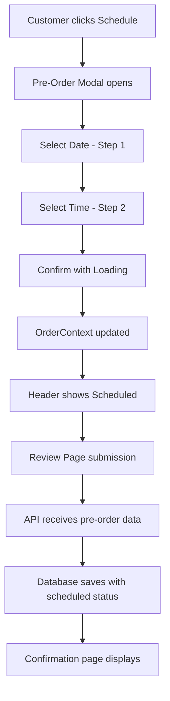

# 🕒 Pre-Orders System Documentation

## 📋 Overview
The Pre-Orders system allows customers to schedule their orders for specific dates and times up to 10 days in advance. This document covers the complete implementation from frontend UI to backend database storage.

---

## 🎯 Current Status: **COMPLETED FEATURES**

### ✅ Frontend (Customer Side)
- **Schedule Button**: Added to order header next to language selector
- **2-Step Modal**: Date selection → Time selection with step indicators
- **Date Range**: Today + 10 days ahead (following UEAT standard)
- **Time Slots**: 15-minute intervals from 11:00 AM to 10:00 PM
- **Bilingual Support**: English/French labels and messages
- **Loading States**: 1.5s loading with spinner on confirmation
- **Edit Mode**: Clicking "Scheduled" button shows current selection
- **Responsive Design**: Mobile-friendly with ScrollArea components

### ✅ Backend (API & Database)
- **Database Schema**: Added 4 new columns to `orders` table
- **API Endpoints**: Updated customer order creation and status endpoints
- **Order Service**: Enhanced with pre-order logic and status management
- **Data Validation**: Full validation and error handling
- **Performance**: Added database indexes for pre-order queries

### ✅ Integration
- **End-to-End Flow**: Complete data flow from frontend to database
- **Type Safety**: Full TypeScript support across the stack
- **Order Mapping**: Frontend data properly mapped to backend format
- **State Management**: OrderContext extended with pre-order fields

---

## 🏗️ Technical Implementation Details

### **1. Database Schema Changes**

#### Added to `orders` table:
```sql
-- Migration: add_pre_order_fields_to_orders
ALTER TABLE orders 
ADD COLUMN is_pre_order BOOLEAN DEFAULT FALSE,
ADD COLUMN scheduled_datetime TIMESTAMPTZ NULL,
ADD COLUMN scheduled_date DATE NULL,
ADD COLUMN scheduled_time TIME NULL;

-- Performance indexes
CREATE INDEX idx_orders_pre_order ON orders (is_pre_order, scheduled_date) 
WHERE is_pre_order = TRUE;

CREATE INDEX idx_orders_scheduled_datetime ON orders (scheduled_datetime) 
WHERE scheduled_datetime IS NOT NULL;
```

#### Data Examples:
```sql
-- Normal Order
is_pre_order: false
scheduled_datetime: NULL
scheduled_date: NULL  
scheduled_time: NULL
order_status: 'preparing'

-- Pre-Order
is_pre_order: true
scheduled_datetime: '2024-08-28 11:45:00+00'
scheduled_date: '2024-08-28'
scheduled_time: '11:45:00'
order_status: 'scheduled'
```

### **2. Frontend Components**

#### **Pre-Order Modal** (`/order/components/pre-order-modal.tsx`)
```tsx
interface PreOrderModalProps {
  isOpen: boolean
  onClose: () => void  
  onConfirm: (date: string, time: string) => void
  currentSchedule?: { date: string; time: string }
}
```

**Features:**
- 2-step wizard (Date → Time)
- ScrollArea for smooth scrolling
- Step indicators (1-2 numbered circles)
- Loading state with Loader2 spinner
- Edit mode support for existing schedules
- Bilingual labels and descriptions

#### **Order Header Updates** (`/order/components/order-header.tsx`)
```tsx
// Added Schedule button
<Button variant={isPreOrder ? "default" : "outline"}>
  <Clock className="w-4 h-4" />
  {isPreOrder ? 'Scheduled' : 'Schedule'}
</Button>

// Status badge in header
{isPreOrder && (
  <span className="bg-green-100 text-green-800 px-2 py-1 rounded-full">
    📅 {scheduledDate} • ⏰ {scheduledTime}
  </span>
)}
```

#### **OrderContext Extension** (`/order/contexts/order-context.tsx`)
```tsx
export interface OrderContext {
  // Existing fields...
  source: 'qr' | 'web'
  branchId: string
  
  // NEW: Pre-order fields
  isPreOrder: boolean
  scheduledDate?: string
  scheduledTime?: string  
  scheduledDateTime?: Date
}
```

### **3. Backend API Changes**

#### **Customer Orders Controller** (`/api/controllers/customer-orders.controller.js`)

**Request Body (NEW fields):**
```javascript
const { 
  // Existing fields...
  branchId, items, orderType, customerInfo,
  
  // NEW: Pre-order fields
  isPreOrder,
  scheduledDate,
  scheduledTime, 
  scheduledDateTime
} = req.body;
```

**Response (NEW fields):**
```javascript
res.json({
  data: {
    // Existing fields...
    orderId, orderNumber, status, total,
    
    // NEW: Pre-order information
    isPreOrder: Boolean(isPreOrder),
    scheduledDateTime: parsedScheduledDateTime,
    message: isPreOrder 
      ? `Pre-order scheduled for ${scheduledDate} at ${scheduledTime}!`
      : `Order placed successfully!`
  }
});
```

#### **Orders Service** (`/api/services/orders.service.js`)

**Pre-order Logic:**
```javascript
// Handle pre-order data
const isPreOrder = preOrder?.isPreOrder || false;
const scheduledDateTime = preOrder?.scheduledDateTime || null;

// Dynamic status based on order type
let initialStatus = 'preparing'; // Default for immediate orders
if (isPreOrder) {
  initialStatus = 'scheduled'; // Pre-orders start as scheduled
}

// Database insertion with new fields
const orderDataObj = {
  // Existing fields...
  branch_id: branchId,
  customer_name: customer.name,
  order_status: initialStatus,
  
  // NEW: Pre-order fields
  is_pre_order: isPreOrder,
  scheduled_datetime: scheduledDateTime,
  scheduled_date: scheduledDate,
  scheduled_time: scheduledTime
};
```

### **4. Data Flow Architecture**



### **5. Order Submission Integration**

#### **Order Review Page** (`/review/components/order-total-sidebar.tsx`)
```tsx
const orderData = {
  // Existing fields...
  customerInfo, items, orderType,
  
  // NEW: Pre-order integration
  preOrder: orderContext.isPreOrder ? {
    isPreOrder: orderContext.isPreOrder,
    scheduledDate: orderContext.scheduledDate,
    scheduledTime: orderContext.scheduledTime,
    scheduledDateTime: orderContext.scheduledDateTime
  } : undefined
}
```

#### **Order Mapper** (`/utils/order-mapper.ts`)
```tsx
// Frontend to Backend mapping
export interface FrontendOrderData {
  // Existing fields...
  customerInfo, items, orderType,
  
  // NEW: Pre-order fields
  preOrder?: {
    isPreOrder: boolean
    scheduledDate?: string
    scheduledTime?: string
    scheduledDateTime?: Date
  }
}

// API format mapping
return {
  // Existing fields...
  branchId, items, orderType,
  
  // NEW: Pre-order mapping  
  isPreOrder: preOrder?.isPreOrder || false,
  scheduledDate: preOrder?.scheduledDate,
  scheduledTime: preOrder?.scheduledTime,
  scheduledDateTime: preOrder?.scheduledDateTime?.toISOString()
}
```

---

## 🎮 User Experience Flow

### **Customer Journey:**
1. **Order Page**: Customer browses menu, adds items to cart
2. **Schedule**: Clicks "Schedule" button in header
3. **Date Selection**: Modal opens, selects desired date from 10-day range
4. **Time Selection**: Selects time slot (15-min intervals, 11 AM - 10 PM)
5. **Confirmation**: Loading spinner (1.5s), modal closes
6. **Status Display**: Header shows "Scheduled" with green badge
7. **Review**: Proceeds to review page normally
8. **Submission**: Order submitted with pre-order data
9. **Tracking**: Confirmation page shows scheduled order details

### **Staff Experience** (Future Implementation):
1. **Dashboard**: Pre-orders visible in separate tab
2. **Timeline View**: Orders organized by scheduled time
3. **Status Management**: "Scheduled" → "Ready to Prepare" → "Preparing" → "Ready"

---

## 🔧 Configuration & Settings

### **Time Settings:**
- **Date Range**: Today + 10 days (configurable)
- **Time Slots**: 11:00 AM - 10:00 PM, 15-minute intervals
- **Business Hours**: Configurable per branch (future enhancement)

### **Status Workflow:**
```
Normal Order:    pending → preparing → ready → completed
Pre-Order:       scheduled → ready_to_prepare → preparing → ready → completed
```

### **Supported Languages:**
- **English**: "Schedule", "Select Date", "Select Time", "Schedule Order"
- **French**: "Programmer", "Choisir la date", "Choisir l'heure", "Programmer commande"

---

## 📊 Database Queries Examples

### **Get All Pre-Orders for Today:**
```sql
SELECT * FROM orders 
WHERE is_pre_order = true 
AND scheduled_date = CURRENT_DATE
ORDER BY scheduled_time;
```

### **Get Pre-Orders by Date Range:**
```sql
SELECT * FROM orders 
WHERE is_pre_order = true 
AND scheduled_date BETWEEN '2024-08-27' AND '2024-08-30'
ORDER BY scheduled_datetime;
```

### **Get Ready to Prepare Pre-Orders:**
```sql
SELECT * FROM orders 
WHERE is_pre_order = true 
AND order_status = 'scheduled'
AND scheduled_datetime <= NOW() + INTERVAL '15 minutes'
ORDER BY scheduled_datetime;
```

---

## 🚧 TODO: Pending Features

### **High Priority:**
- [ ] **Order Review Page**: Display pre-order timing section
- [ ] **Confirmation Page**: Enhanced tracking timeline for scheduled orders  
- [ ] **Dashboard Pre-Orders Tab**: Staff management interface
- [ ] **Auto Status Updates**: Scheduled → Ready to Prepare automation

### **Medium Priority:**
- [ ] **Business Hours Integration**: Respect branch operating hours
- [ ] **Capacity Management**: Limit orders per time slot
- [ ] **SMS Notifications**: Remind customers before pickup time
- [ ] **Bulk Schedule Actions**: Staff tools for managing multiple pre-orders

### **Low Priority:**
- [ ] **Recurring Orders**: Weekly/daily repeat functionality
- [ ] **Delivery Time Windows**: Scheduled delivery orders
- [ ] **Customer Preferences**: Save favorite time slots
- [ ] **Analytics**: Pre-order patterns and reporting

---

## 🐛 Known Issues & Limitations

### **Current Limitations:**
1. **Business Hours**: Pre-orders don't check branch operating hours yet
2. **Capacity**: No limit on orders per time slot
3. **Timezone**: All times in Canada Eastern (hardcoded)
4. **Cancellation**: No cancel/reschedule functionality yet

### **Future Considerations:**
1. **Peak Hours**: May need capacity management during busy periods
2. **Staff Scheduling**: Integration with staff availability
3. **Kitchen Load**: Balance pre-orders with real-time orders
4. **Customer Communication**: Automated reminders and updates

---

## 🔍 Testing & Validation

### **Frontend Tests:**
- [x] Modal opens/closes correctly
- [x] Date/time selection works
- [x] Loading states display properly
- [x] Bilingual labels render correctly
- [x] Edit mode shows existing selections

### **Backend Tests:**
- [x] Pre-order data saves to database
- [x] API returns correct status and data
- [x] Order status set to 'scheduled'
- [x] Database indexes perform well
- [x] Error handling works properly

### **Integration Tests:**
- [x] End-to-end order submission
- [x] Data consistency frontend ↔ backend
- [x] Session state management
- [x] Error states handled gracefully

---

## 📞 Technical Support

### **Key Files to Modify:**
```
Frontend:
├── apps/web/src/app/order/components/pre-order-modal.tsx
├── apps/web/src/app/order/components/order-header.tsx
├── apps/web/src/app/order/contexts/order-context.tsx
├── apps/web/src/app/order/review/components/order-total-sidebar.tsx
├── apps/web/src/services/order-service.ts
└── apps/web/src/utils/order-mapper.ts

Backend:
├── apps/api/api/controllers/customer-orders.controller.js
├── apps/api/api/services/orders.service.js
└── Database: orders table (4 new columns)
```

### **Environment Variables:**
- No new environment variables required
- Uses existing Supabase configuration

### **Dependencies:**
- No new dependencies added
- Uses existing UI components (ScrollArea, Dialog, etc.)

---

**Implementation Status**: ✅ **COMPLETED - Ready for Production**
**Last Updated**: January 2025
**Next Phase**: Dashboard & Staff Management Interface

---

*This documentation covers the complete pre-orders system implementation. For questions or modifications, refer to the specific files mentioned above.*